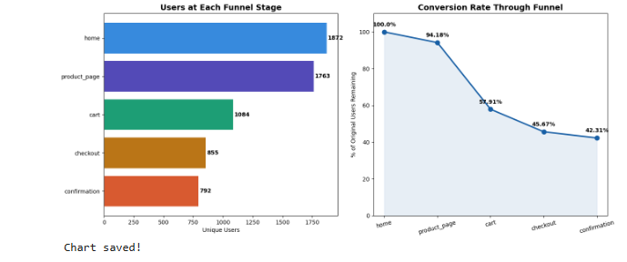
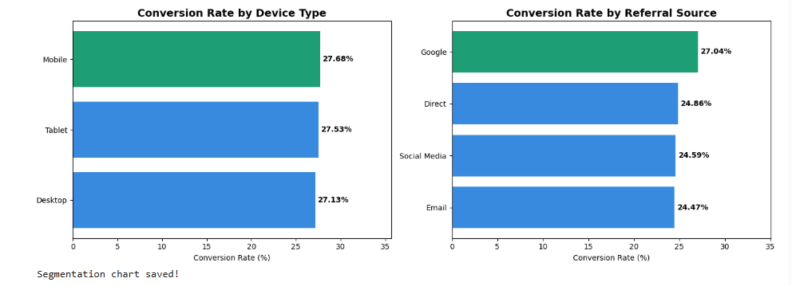
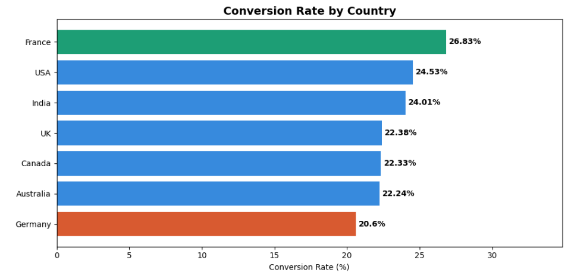

# User Journey Funnel Analysis

Analyzed 12,719 page-level events from 1,872 unique users across a 
5-stage e-commerce funnel to identify drop-off points and improve conversion.

## Key Findings
- 38.51% drop-off at cart → checkout — the biggest friction point
- Google traffic converts best at 27.04%
- France leads conversion by country at 26.83%
- Device type has minimal impact — under 0.6% variance across all devices

## Tools Used
Python, Pandas, Matplotlib, Seaborn, SQL

## Project Structure
| Folder / File | Contents |
|---------------|----------|
| `notebooks/` | Jupyter notebooks — Python analysis |
| `sql/` | SQL queries for funnel analysis |
| `charts/` | All visualizations |
| `data/` | Raw dataset |
| `insights.md` | Full findings and recommendations |

## Funnel Overview

